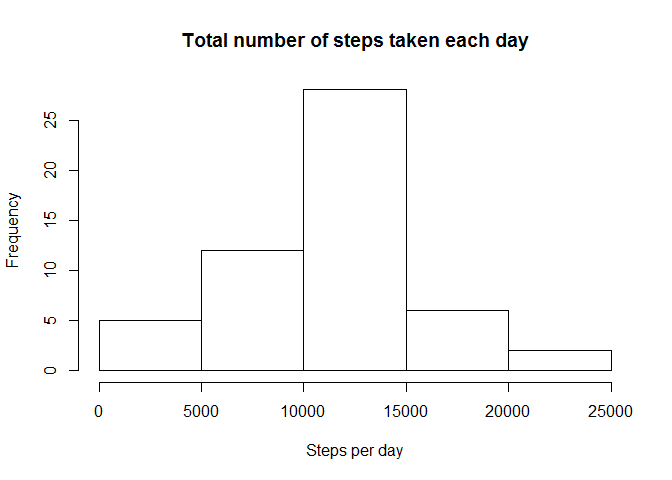
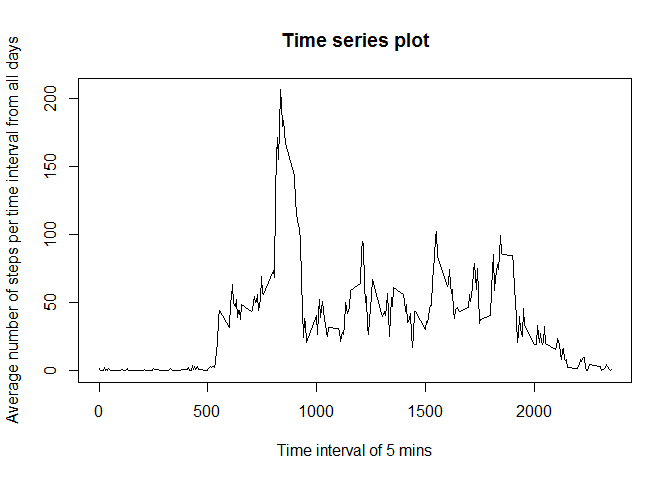
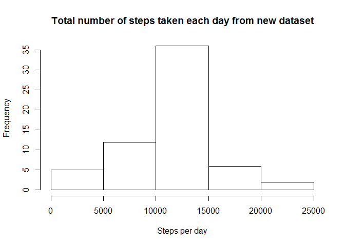

# Reproducible Research: Peer Assessment 1


## Loading and preprocessing the data

Get the data into r's memory

```r
unzip('activity.zip')
activityData <- read.csv('activity.csv')
```

## What is mean total number of steps taken per day?

### 1. Make a histogram of the total number of steps taken each day

```r
# Creates a table which counts the total number of steps taken for each each day
totalStepsTakenPerDay <- aggregate(steps ~ date, data = activityData, FUN = 'sum', na.exclude = T)
# Make the histogram
hist(totalStepsTakenPerDay$steps, xlab="Steps per day", main="Total number of steps taken each day")
```

 

### 2. Calculate and report the mean and median total number of steps taken per day


```r
meanOfTotalNumSteps <- mean(totalStepsTakenPerDay$steps)
medianOfTotalNumSteps <- median(totalStepsTakenPerDay$steps)
```

The mean of the total number of steps is 1.0767189\times 10^{4}.

The mean of the total number of steps is 10766.

## What is the average daily activity pattern?

### 1. Make a time series plot (i.e. type = "l") of the 5-minute interval (x-axis) and the average number of steps taken, averaged across all days (y-axis)


```r
# Creates a table of average number of steps for each time interval
avgStepsPerTimeInterval <- aggregate(steps ~ interval, data = activityData, FUN = 'mean', na.exclude = T)

# Make time series plot
plot (
    x = avgStepsPerTimeInterval$interval
  , y = avgStepsPerTimeInterval$steps 
  , xlab = 'Time interval of 5 mins'
  , ylab = 'Average number of steps per time interval from all days'
  , main = 'Time series plot'
  , type='l'
)
```

 

### 2. Which 5-minute interval, on average across all the days in the dataset, contains the maximum number of steps?


```r
timeIntervalWithMostNumOfSteps <- avgStepsPerTimeInterval[which.max(avgStepsPerTimeInterval$steps), ]$interval 
```

The 5-minute interval, **835**, on average across all the days in the dataset, contains the most number of steps.

## Imputing missing values

### 1. Calculate and report the total number of missing values in the dataset (i.e. the total number of rows with NAs)


```r
numberOfRowsWithNas <- sum((is.na(activityData$steps) | is.na(activityData$date) | is.na(activityData$interval))) 
```

There are **2304** rows with missing values in the dataset.


### 2. Devise a strategy for filling in all of the missing values in the dataset. The strategy does not need to be sophisticated. For example, you could use the mean/median for that day, or the mean for that 5-minute interval, etc.

We can find the rows which contains missing values for the steps column in the dataset. Then for each of those rows, we get the time interval column to query the avgStepsPerTimeInterval dataset, which we had computed earlier, for the average number of steps for that 5-minute interval. We then use the average number of steps value to fill the missing values.


### 3. Create a new dataset that is equal to the original dataset but with the missing data filled in.


```r
# Prepare a data frame for replacing the missing values
activityDataWithoutNa <- activityData
rowsWithStepsNa <- which(is.na(activityDataWithoutNa$steps))

for (rowIndex in rowsWithStepsNa) {
  
  # Get the interval to query for average steps taken
  intervalWithNaSteps <- activityData$interval[rowIndex]
  avgStepsPerTimeIntervalRowIndex = which(avgStepsPerTimeInterval$interval == intervalWithNaSteps)
  activityDataWithoutNa$steps[rowIndex] <- avgStepsPerTimeInterval[avgStepsPerTimeIntervalRowIndex, ]$steps
  
}
```

After the above code is run, we run the following code to determine if the missing values are gone:


```r
numberOfRowsWithNas <- sum(
    (is.na(activityDataWithoutNa$steps) 
     | is.na(activityDataWithoutNa$date) 
     | is.na(activityDataWithoutNa$interval))
    ) 
```

There are **0** rows with missing values in the filled dataset.


### 4. Make a histogram of the total number of steps taken each day and Calculate and report the mean and median total number of steps taken per day. Do these values differ from the estimates from the first part of the assignment? What is the impact of imputing missing data on the estimates of the total daily number of steps?

Make a histogram from the new dataset.


```r
# Creates a table which counts the total number of steps taken for each each day
newTotalStepsTakenPerDay <- aggregate(steps ~ date, data = activityDataWithoutNa, FUN = 'sum', na.exclude = T)
# Make the histogram
hist(newTotalStepsTakenPerDay$steps, xlab="Steps per day", main="Total number of steps taken each day from new dataset")
```

 


```r
meanOfNewTotalNumSteps <- mean(newTotalStepsTakenPerDay$steps)
medianOfNewTotalNumSteps <- median(newTotalStepsTakenPerDay$steps)
```

The mean of the total number of steps is 1.0767189\times 10^{4}.

The mean of the total number of steps is 1.0767189\times 10^{4}.

The impact of imputing missing data to the datasets had increased the total daily number of steps. This had caused the frequency for the 10000 to 15000 range to increase. The mean and median had been affected slightly as well.

## Are there differences in activity patterns between weekdays and weekends?

Convert the date column to date type


```r
activityDataWithoutNa$date <- as.Date(activityDataWithoutNa$date, format = '%Y-%m-%d' ) 
```

### 1. Create a new factor variable in the dataset with two levels -- "weekday" and "weekend" indicating whether a given date is a weekday or weekend day.


```r
days <- weekdays(activityDataWithoutNa$date)
dayTypeVector <- vector()

for (index in 1:length(days)) {
  if (days[index] == 'Saturday' || days[index] == 'Sunday') {
    dayTypeVector[index] <- 'Weekend'
  }
  else {
    dayTypeVector[index] <- 'Weekday'
  }
}

# Assign the day type into the dataset
dayTypeFactor <- factor(dayTypeVector)
activityDataWithoutNa$dayType <- dayTypeFactor
```

### 2. Make a panel plot containing a time series plot (i.e. type = "l") of the 5-minute interval (x-axis) and the average number of steps taken, averaged across all weekday days or weekend days (y-axis). 


```r
stepsPeerWeekTypePerInterval <- aggregate(steps ~ dayType + interval, data = activityDataWithoutNa, FUN = 'mean')
library(lattice)
xyplot(
  steps ~ interval | dayType
  , data = stepsPeerWeekTypePerInterval
  , layout = c(1, 2)
  , type='l'
  )
```

 

#### Observation 1: More people took more steps early in the weekdays than on weekends

As seen from the plot, we can note that on the average, there were more steps taken from the 700 time interval on weekdays than on weekends. This is probably due to more people getting to work in the mornings of weekdays than in the mornings of weekends. 

#### Observation 2: More people took more steps in the morning to evening period in the weekends than on weekdays.

Also, from the 1000 to 2000 time intervals, we saw more steps taken during weekends than on weekdays. This is probably due to people getting more involved activities that requires walking in weekends (for eg, exercising or shopping), as opposed to people staying put at one location during weekdays. This could be because weekdays are work days for most people when most people are not moving around too much.   
